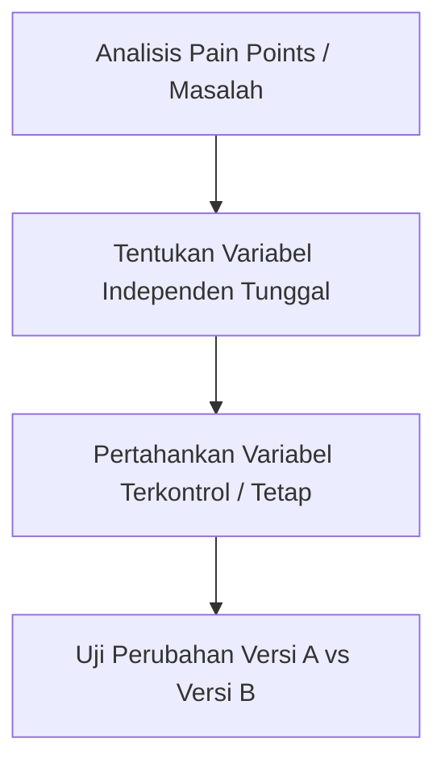

# 📊 Panduan Komprehensif: Rencana & Metrik Pengujian (A/B Testing & Usability Testing)
**EventEase Platform (Stitch + Neon Event Seat Booking)**

---

## 🎯 Bagian 1: Tujuan Testing (Testing Objectives)

Dalam proyek **EventEase**, kita menerapkan dua jenis pengujian yang saling melengkapi untuk mengukur aspek yang berbeda dari pengalaman pengguna:

### 1. Tujuan A/B Testing (Kuantitatif & Ilmiah)
* **Tujuan Utama**: Menguji pengaruh tata letak/posisi tombol konversi utama terhadap minat/inisiasi transaksi pengguna secara riil.
* **Fokus**: Mengetahui apakah memindahkan tombol **"Checkout"** dari navigasi atas ke samping denah kursi dapat menurunkan tingkat kebingungan visual (*visual friction*) dan meningkatkan rasio klik.
* **Kaitan File**: Rincian rencana ini terdokumentasi lengkap di [hasil.md](file:///e:/stitch_neon_event_seat_booking/eventseats/hasil.md).

### 2. Tujuan Usability Testing (Kualitatif & Alur)
* **Tujuan Utama**: Menguji kemudahan navigasi, kejelasan instruksi, dan kestabilan sistem dari kacamata pengguna riil saat menyelesaikan transaksi dari awal hingga akhir.
* **Fokus**: Menemukan hambatan penggunaan (*usability issues*), seperti pengisian data berulang atau field email yang terkunci, sehingga alur transaksi menjadi lebih mulus.
* **Kaitan File**: Evaluasi alur usability testing terdokumentasi di [proseduroutput.md](file:///e:/stitch_neon_event_seat_booking/eventseats/proseduroutput.md).

---

## 🛠️ Bagian 2: Menentukan Apa yang Diubah (Decide What to Change)

Menentukan elemen yang akan diubah harus didasarkan pada data analitik atau observasi awal, serta mematuhi **Prinsip Isolasi Variabel Tunggal** agar hasil pengujian valid secara ilmiah.



### 1. Apa yang Diubah pada A/B Testing?
Sesuai kaidah pengujian akademis, hanya **satu variabel** yang diubah untuk menghindari bias multivariabel:
* **VARIABEL BEBAS (Yang Diubah)**: 
  * **Versi A (Control)**: Tombol **"Checkout"** berada di **Navigasi Header (Atas)**.
  * **Versi B (Challenger)**: Tombol **"Checkout"** dipindahkan ke **Sidebar Kanan** (Tepat di bawah rincian harga).
* **VARIABEL TERKONTROL (Yang Wajib Sama/Tetap)**:
  * Teks tombol tetap `"Checkout"`.
  * Warna tombol tetap biru (`bg-blue-600` saat aktif, `bg-slate-100` saat nonaktif).
  * Ukuran font, jenis huruf, dan fungsionalitas pengalihan URL ke `/checkout` tetap 100% sama.

### 2. Apa yang Diubah pada Skenario Usability Testing?
Berdasarkan hasil temuan riil di [proseduroutput.md](file:///e:/stitch_neon_event_seat_booking/eventseats/proseduroutput.md), alur pengujian harus diubah dari **Profile-First** menjadi **User-Journey yang Natural**:
* **Sebelumnya (Kurang Efisien)**: Mengisi data profil & kartu pembayaran di awal, lalu melakukan pemesanan (tetap diminta mengisi data lagi di halaman checkout).
* **Setelah Diubah (Lebih Natural)**: Pengguna mencari event terlebih dahulu -> Memilih kursi -> Melakukan pembayaran -> Memverifikasi e-ticket -> Baru kemudian mengelola profil & kartu cadangan.

---

## 📈 Bagian 3: Metrik Pengukuran (Measurement Metrics)

Setiap jenis pengujian membutuhkan metrik yang terukur untuk membuktikan apakah perubahan yang dilakukan memberikan hasil yang lebih baik.

### A. Metrik Utama untuk A/B Testing (Kuantitatif)

| Metrik | Rumus / Cara Kerja | Tujuan Pengukuran |
| :--- | :--- | :--- |
| **Checkout Initiation Rate (CIR)** | $$\text{CIR} = \frac{\text{Klik Tombol Checkout}}{\text{Jumlah Sesi Memilih Kursi}} \times 100\%$$ | Mengukur efektivitas posisi tombol dalam memicu inisiasi pembayaran. |
| **Conversion Rate (CR)** | $$\text{CR} = \frac{\text{Transaksi Sukses (Stripe)}}{\text{Total Pengunjung Halaman}} \times 100\%$$ | Memastikan kenaikan klik tombol berdampak langsung ke penjualan riil. |
| **Statistical Significance ($p$-value)** | Diuji dengan metode **Chi-Square** atau **T-Test** | Memastikan bahwa perbedaan hasil antara Versi A dan Versi B **bukan karena faktor kebetulan** (Target: Confidence Level 95%, $p < 0.05$). |

### B. Metrik Utama untuk Usability Testing (Kualitatif)

1. **Task Completion Rate (TCR)**: Persentase partisipan yang berhasil menyelesaikan tugas tanpa bantuan eksternal (Target: > 90%).
2. **Time on Task (ToT)**: Rata-rata waktu yang dibutuhkan partisipan untuk menyelesaikan satu tugas (misal: mencari event hingga checkout).
3. **Error Rate (Rasio Kesalahan)**: Frekuensi kesalahan yang dilakukan partisipan selama pengujian (misal: mengetik huruf di kolom nomor telepon, atau kebingungan karena email *read-only*).
4. **System Usability Scale (SUS)**: Kuesioner dengan 10 pertanyaan standar setelah pengujian untuk mengukur kepuasan pengguna terhadap kemudahan aplikasi.

---

## 👥 Bagian 4: Menentukan Partisipan dan Task

### 1. Menentukan Partisipan (Who to Test)
Untuk mendapatkan hasil uji yang valid dan kredibel:
* **Kriteria Partisipan**: 
  * Pengguna aktif internet (rentang usia 17–45 tahun).
  * Pernah melakukan pembelian tiket secara online minimal sekali dalam 6 bulan terakhir.
  * Terdiri dari kelompok *tech-savvy* (biasa bertransaksi online) dan *non-tech-savvy* (pengguna awam).
* **Ukuran Sampel**:
  * **A/B Testing**: Pembagian trafik pengunjung `/seat-selection` secara acak sebesar **50% untuk Versi A** dan **50% untuk Versi B** (Skala massal, misal minimal 1000 sesi).
  * **Usability Testing**: Cukup **5 - 8 partisipan riil** (Sesuai kaidah Nielsen Norman Group, 5 partisipan sudah mampu menemukan >85% masalah kegunaan utama).

### 2. Menentukan Task (Tugas Pengujian)
Task disusun berdasarkan alur **User Journey yang direkomendasikan** agar partisipan merasa alurnya logis dan menyenangkan.

Berikut daftar 5 Task Utama beserta Skenarionya (disadur dari [usecase.md](file:///e:/stitch_neon_event_seat_booking/eventseats/usecase.md) & [task.md](file:///e:/stitch_neon_event_seat_booking/eventseats/task.md)):

```
[Halaman Utama] 
      │
      ▼
Task 1: Cari Event "Anta Show" via Search Bar
      │
      ▼
Task 2: Pilih Kursi (A3) & Klik "Checkout"
      │
      ▼
Task 3: Proses Bayar di Stripe Sandbox (Kartu Uji: 4242...)
      │
      ▼
Task 4: Masuk ke "My Tickets" & Periksa Status CONFIRMED + QR Code
      │
      ▼
Task 5: Update Profil & Simpan Kartu Pembayaran Cadangan
```

#### Rincian Panduan Skenario Task untuk Tester:
1. **Task 1: Eksplorasi & Pencarian**
   * *Instruksi*: *"Anda sedang mencari pertunjukan musik akhir pekan. Temukan event bernama 'Anta Show' lewat fitur pencarian halaman utama, lalu buka detail event tersebut."*
2. **Task 2: Memesan Kursi & Inisiasi Checkout**
   * *Instruksi*: *"Pilih kursi favorit Anda (contoh: baris depan `A3`) dan lanjutkan ke proses pemesanan dengan menekan tombol Checkout. Isi data kontak Anda."*
3. **Task 3: Pembayaran Aman**
   * *Instruksi*: *"Selesaikan pembayaran tiket Anda menggunakan kartu uji Stripe sandbox (`4242 4242 4242 4242`, exp `12/28`, cvv `123`)."*
4. **Task 4: Validasi Kepemilikan Tiket**
   * *Instruksi*: *"Pastikan tiket Anda telah berhasil dipesan dengan membuka menu tiket Anda. Periksa apakah kode QR tiket sudah aktif."*
5. **Task 5: Manajemen Profil**
   * *Instruksi*: *"Perbarui profil Anda dengan nomor HP terbaru dan simpan kartu pembayaran cadangan Anda di menu pengaturan profil untuk transaksi berikutnya."*

---

> [!TIP]
> **Mengapa Rencana Ini Sangat Valid secara Akademik & Industri?**
> Karena rencana ini memisahkan secara tegas antara **Metrik Kuantitatif Layout** (A/B Testing pada posisi tombol di halaman `/seat-selection`) dengan **Metrik Kualitatif Alur** (Usability Testing pada urutan pemesanan). Hal ini membuat hasil pengujian Anda 100% bebas dari bias variabel campuran.
